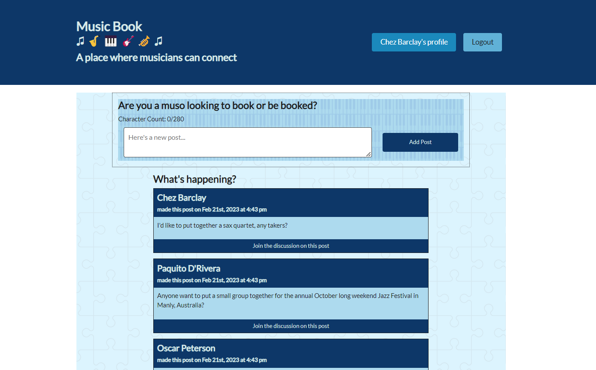

<h1>Music Book</h1>
 
## Table of Contents
* [Description](#description)
* [User Story](#user-story)
* [Acceptance Criteria](#acceptance-criteria)
* [Screenshot](#screenshot)
* [Technology](#technology) 
* [Installation](#installation) 
* [Usage](#usage) 
* [Features](#features)
* [Heroku Link](#heroku-link)
* [Contact Me](#contact-me)
* [Credits](#credits) 
* [Questions](#questions)
* [License](#license)

## Description
Music Book is a MERN stack application using React for the frontend, GraphQL with a Node.js and Express.js server and MongoDB with the Mongoose ODM for the database.

 
## User Story
AS A passionate musician<br>
I WANT to connect with other musicians<br>
SO THAT I can find other musicians to gig with and keep up to date with what's happening on the music scene.
 
## Acceptance Criteria
GIVEN a music book app,<br>
WHEN I load the application,
THEN I am presented with a menu with the options to Login or Signup and messages posted on the home page.<br>
WHEN I am not logged in and try to comment on a post,<br>
THEN I am presented with a message that I need to be logged in to add a comment.<br>
WHEN I click on the Signup menu option,<br>
THEN I am presented with three inputs for a username, an email address, and a password, and a signup button.<br>
WHEN I select Login,<br>
THEN I am presented with two inputs for an email address and a password and Submit button.<br>
WHEN I enter a valid email address and create a password and click on the Submit button,<br>
THEN my user account is created and I am logged in to the site.<br>
WHEN I enter my account’s email address and password and click on the login button,<br>
THEN I am logged in to the site.<br>
WHEN I am logged in to the site,<br>
THEN the menu options change to 'myname's' profile, where I can view all of the posts that I have made, and Logout. A test box opens and I have the option to add my own post.<br>
WHEN I am logged in and click on my profile from the menu in the header,<br>
THEN I am presented with a list of the posts I have made and the option to make another post.<br>
WHEN I click on the Go Back button on the bottom of the page, or the link named Music Book in the header,<br>
THEN I am taken back to the home page where I can see all of the posts;<br>
THEN I can select any of the 'Join the discussion' links on the bottom of each post.<br>
WHEN I click on the 'Join the discssion' link on a post,<br>
THEN I see that single post and a text box opens up for me to comment, then select the Add Comment button.<br>
WHEN I write my comment and select the Add Commnt button,<br>
THEN I can see my comment has been added to the comments section of the original post.<br>
WHEN I want to add my own post,<br>
THEN I can navigate to either the Add Post text box on the home page, or the Add Post text box that displays in my profile.<br>
WHEN I add my post,<br>
THEN I can view my post on my profile or on the home page.<br>
WHEN I view my posts on my profile page,<br>
THEN I the options to remove or update my post becomes available.<br>
WHEN I select remove post and refresh my browser,<br>
THEN my selected post is removed.<br>
WHEN I select update my post,<br>
THEN I am able to edit my post and save the changes.<br>
WHEN I select the Logout button,<br>
THEN I am logged out of the site and presented with a menu with the options Login or Signup and the home page displaying all posts. 

## Screenshot

 
## Technology
This project has been created with:
- Javascript, Node.js, Express.js
- React
- MERN stack single page application
- Apollo Server Express / Apollo Client
- GraphQL
- MongoDB and Mongoose ODM
- Jsonwebtoken / JWT Decode
- Concurrently
- Bcrypt
- Nodemon

## Installation
To setup the application in local, run `npm i` to install the packages listed in the package.json files. 

## Usage
After installing npm packages, the application will be invoked by using the following command:
```
npm run develop
```

## Features
* Uses React for the front end.​
* Uses GraphQL with a Node.js and Express.js server.​
* Uses MongoDB and the Mongoose ODM for the database.​
* Uses queries and mutations for retrieving, adding, updating, and deleting data.​
* Is deployed using Heroku (with data).​
* Have a polished UI.​
* Is responsive.​
* Is interactive (i.e., accept and respond to user input).​
* Includes authentication (JWT).​ 
* Has a clean repository that meets quality coding standards (file structure, naming conventions, best practices for class and id naming conventions, indentation, high-quality comments, etc.).​
* Has a high-quality README (with unique name, description, technologies used, screenshot, and link to deployed application).

## Heroku Link
[Click here for Heroku Link]( )
 
## Contact Me
* GitHub: [CheBar1](https://github.com/CheBar1)
* Email: chebarclay@live.com.au

## Credits
* University of Adelaide - Coding Bootcamp;
* GitHub;
* Youtube.com;
 
## Questions
Please send your questions [here](mailto:chebarclay@live.com.au) or visit [github/CheBar1](https://github.com/CheBar1).

## License
[](https://opensource.org/licenses/MIT) <br>
This project is licensed under MIT, for more information please visit [this website](https://opensource.org/licenses/MIT)
[this website](https://opensource.org/licenses/MIT)